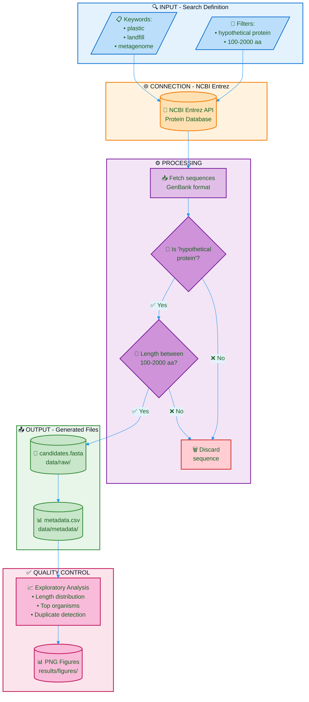

# Deep-PETase-Mining: Flowchart - Phase 1

## Color Legend

| Color | Meaning |
|-------|---------|
| 🔵 Blue | Inputs |
| 🟠 Orange | API Connection |
| 🟣 Purple | Processes |
| 🔴 Red | Discarded |
| 🟢 Green | Outputs |
| 🌸 Pink | Quality Control |
