# Deep-PETase-Mining: Flowchart - Phase 1

```mermaid
%%{init: {'theme': 'base', 'themeVariables': { 'primaryColor': '#e8f5e9', 'primaryTextColor': '#1b5e20', 'primaryBorderColor': '#4caf50', 'lineColor': '#2196f3', 'secondaryColor': '#e3f2fd', 'tertiaryColor': '#fff3e0'}}}%%

graph TD
    subgraph INPUT["🔍 INPUT - Search Definition"]
        style INPUT fill:#e3f2fd,stroke:#1976d2,stroke-width:2px
        A[/"📋 Keywords:<br/>• plastic<br/>• landfill<br/>• metagenome"/]
        B[/"🎯 Filters:<br/>• hypothetical protein<br/>• 100-2000 aa"/]
    end

    subgraph API["🌐 CONNECTION - NCBI Entrez"]
        style API fill:#fff3e0,stroke:#f57c00,stroke-width:2px
        C[("🔗 NCBI Entrez API<br/>Protein Database")]
    end

    subgraph PROCESS["⚙️ PROCESSING"]
        style PROCESS fill:#f3e5f5,stroke:#7b1fa2,stroke-width:2px
        D["📥 Fetch sequences<br/>GenBank format"]
        E{"🧬 Is 'hypothetical<br/>protein'?"}
        F{"📏 Length between<br/>100-2000 aa?"}
        G["🗑️ Discard<br/>sequence"]
    end

    subgraph OUTPUT["📤 OUTPUT - Generated Files"]
        style OUTPUT fill:#e8f5e9,stroke:#388e3c,stroke-width:2px
        H[("📄 candidates.fasta<br/>data/raw/")]
        I[("📊 metadata.csv<br/>data/metadata/")]
    end

    subgraph QC["✅ QUALITY CONTROL"]
        style QC fill:#fce4ec,stroke:#c2185b,stroke-width:2px
        J["📈 Exploratory Analysis<br/>• Length distribution<br/>• Top organisms<br/>• Duplicate detection"]
        K[("📊 PNG Figures<br/>results/figures/")]
    end

    %% Main connections
    A --> C
    B --> C
    C --> D
    D --> E
    E -->|"✅ Yes"| F
    E -->|"❌ No"| G
    F -->|"✅ Yes"| H
    F -->|"❌ No"| G
    H --> I
    I --> J
    J --> K

    %% Individual node styles
    style A fill:#bbdefb,stroke:#1976d2,stroke-width:2px
    style B fill:#bbdefb,stroke:#1976d2,stroke-width:2px
    style C fill:#ffe0b2,stroke:#f57c00,stroke-width:2px
    style D fill:#e1bee7,stroke:#7b1fa2,stroke-width:2px
    style E fill:#ce93d8,stroke:#7b1fa2,stroke-width:2px
    style F fill:#ce93d8,stroke:#7b1fa2,stroke-width:2px
    style G fill:#ffcdd2,stroke:#d32f2f,stroke-width:2px
    style H fill:#c8e6c9,stroke:#388e3c,stroke-width:2px
    style I fill:#c8e6c9,stroke:#388e3c,stroke-width:2px
    style J fill:#f8bbd9,stroke:#c2185b,stroke-width:2px
    style K fill:#f8bbd9,stroke:#c2185b,stroke-width:2px
```

## Color Legend

| Color | Meaning |
|-------|---------|
| 🔵 Blue | Inputs |
| 🟠 Orange | API Connection |
| 🟣 Purple | Processes |
| 🔴 Red | Discarded |
| 🟢 Green | Outputs |
| 🌸 Pink | Quality Control |
