# Deep-PETase-Mining: Flowchart - Phase 2

```mermaid
%%{init: {'theme': 'base', 'themeVariables': { 'primaryColor': '#e8f5e9', 'primaryTextColor': '#1b5e20', 'primaryBorderColor': '#4caf50', 'lineColor': '#2196f3', 'secondaryColor': '#e3f2fd', 'tertiaryColor': '#fff3e0'}}}%%

graph TD
    subgraph INPUT["📥 INPUT - Raw Sequences"]
        style INPUT fill:#e3f2fd,stroke:#1976d2,stroke-width:2px
        A[("📄 raw_candidates.fasta<br/>39,000 sequences")]
        B[("🧬 ispetase_ref.fasta<br/>Reference PETase")]
    end

    subgraph HOMOLOGY["🔬 HOMOLOGY FILTERING"]
        style HOMOLOGY fill:#fff3e0,stroke:#f57c00,stroke-width:2px
        C["🔗 Pairwise Alignment<br/>Smith-Waterman"]
        D{"📊 Identity<br/>> 30%?"}
        E{"📊 Identity<br/>< 90%?"}
        F["🗑️ Too divergent<br/>Discard"]
        G["🗑️ Too similar<br/>(known enzyme)"]
    end

    subgraph MOTIF["🎯 MOTIF SCANNING"]
        style MOTIF fill:#f3e5f5,stroke:#7b1fa2,stroke-width:2px
        H["🔍 Search G-x-S-x-G<br/>Serine hydrolase motif"]
        I{"🧪 Catalytic<br/>motif found?"}
        J["🗑️ No catalytic<br/>potential"]
    end

    subgraph OUTPUT["📤 OUTPUT - Filtered Sequences"]
        style OUTPUT fill:#e8f5e9,stroke:#388e3c,stroke-width:2px
        K[("📄 candidates_homology.fasta<br/>Homologs")]
        L[("📄 candidates_final_seqs.fasta<br/>8,500 sequences")]
        M[("📊 homology_scores.csv<br/>Alignment results")]
    end

    subgraph VIZ["📊 VISUALIZATION"]
        style VIZ fill:#fce4ec,stroke:#c2185b,stroke-width:2px
        N["📈 Identity Distribution"]
        O["📊 Filtering Funnel"]
        P["🖼️ Score vs Identity"]
    end

    %% Main connections
    A --> C
    B --> C
    C --> D
    D -->|"✅ Yes"| E
    D -->|"❌ No"| F
    E -->|"✅ Yes"| K
    E -->|"❌ No"| G
    K --> M
    K --> H
    H --> I
    I -->|"✅ Yes"| L
    I -->|"❌ No"| J
    M --> N
    L --> O
    N --> P
    O --> P

    %% Individual node styles
    style A fill:#bbdefb,stroke:#1976d2,stroke-width:2px
    style B fill:#bbdefb,stroke:#1976d2,stroke-width:2px
    style C fill:#ffe0b2,stroke:#f57c00,stroke-width:2px
    style D fill:#ffcc80,stroke:#f57c00,stroke-width:2px
    style E fill:#ffcc80,stroke:#f57c00,stroke-width:2px
    style F fill:#ffcdd2,stroke:#d32f2f,stroke-width:2px
    style G fill:#ffcdd2,stroke:#d32f2f,stroke-width:2px
    style H fill:#e1bee7,stroke:#7b1fa2,stroke-width:2px
    style I fill:#ce93d8,stroke:#7b1fa2,stroke-width:2px
    style J fill:#ffcdd2,stroke:#d32f2f,stroke-width:2px
    style K fill:#c8e6c9,stroke:#388e3c,stroke-width:2px
    style L fill:#a5d6a7,stroke:#2e7d32,stroke-width:2px
    style M fill:#c8e6c9,stroke:#388e3c,stroke-width:2px
    style N fill:#f8bbd9,stroke:#c2185b,stroke-width:2px
    style O fill:#f8bbd9,stroke:#c2185b,stroke-width:2px
    style P fill:#f8bbd9,stroke:#c2185b,stroke-width:2px
```

## Color Legend

| Color | Meaning |
|-------|---------|
| 🔵 Blue | Inputs |
| 🟠 Orange | Homology Analysis |
| 🟣 Purple | Motif Scanning |
| 🔴 Red | Discarded |
| 🟢 Green | Outputs |
| 🌸 Pink | Visualization |

## Phase 2 Summary

| Step | Description | Tool/Method |
|------|-------------|-------------|
| Reference | IsPETase from *I. sakaiensis* | UniProt A0A0K8P6T7 |
| Alignment | Local pairwise alignment | Smith-Waterman |
| Identity filter | 30% < identity < 90% | Biopython |
| Motif scan | G-x-S-x-G serine hydrolase | Regex pattern |
| Output | 8,500 filtered sequences | FASTA format |
