# Deep-PETase-Mining: Flowchart - Phase 3

```mermaid
%%{init: {'theme': 'base', 'themeVariables': { 'primaryColor': '#e8f5e9', 'primaryTextColor': '#1b5e20', 'primaryBorderColor': '#4caf50', 'lineColor': '#2196f3', 'secondaryColor': '#e3f2fd', 'tertiaryColor': '#fff3e0'}}}%%

graph TD
    subgraph INPUT["📥 INPUT - Filtered Sequences"]
        style INPUT fill:#e3f2fd,stroke:#1976d2,stroke-width:2px
        A[("📄 candidates_final_seqs.fasta<br/>8,500 sequences")]
    end

    subgraph CLUSTER["🔄 CLUSTERING"]
        style CLUSTER fill:#fff3e0,stroke:#f57c00,stroke-width:2px
        B["🧬 CD-HIT Clustering<br/>80% identity threshold"]
        C[("📄 candidates_clustered.fasta<br/>Representative sequences")]
    end

    subgraph PREDICT["🧠 STRUCTURE PREDICTION"]
        style PREDICT fill:#e1f5fe,stroke:#0288d1,stroke-width:2px
        D["🤖 ESMFold API<br/>Meta AI Deep Learning"]
        E["⏳ Process sequences<br/>~2-5 min per structure"]
        F[("📁 results/structures/*.pdb<br/>3D structures")]
    end

    subgraph FILTER["🔍 QUALITY FILTERING"]
        style FILTER fill:#f3e5f5,stroke:#7b1fa2,stroke-width:2px
        G["📊 Extract pLDDT scores<br/>from B-factor field"]
        H{"📈 Average pLDDT<br/>≥ 70?"}
        I["✅ High confidence<br/>Keep structure"]
        J["⚠️ Low confidence<br/>Move to low_confidence/"]
    end

    subgraph OUTPUT["📤 OUTPUT - Quality Structures"]
        style OUTPUT fill:#e8f5e9,stroke:#388e3c,stroke-width:2px
        K[("📁 1,718 high-quality<br/>PDB structures")]
        L[("📊 structure_quality.csv<br/>pLDDT scores")]
    end

    subgraph VIZ["📊 VISUALIZATION"]
        style VIZ fill:#fce4ec,stroke:#c2185b,stroke-width:2px
        M["📈 pLDDT Distribution"]
        N["📊 Quality Categories"]
        O["🖼️ Phase 3 Summary"]
    end

    %% Main connections
    A --> B
    B --> C
    C --> D
    D --> E
    E --> F
    F --> G
    G --> H
    H -->|"✅ Yes"| I
    H -->|"❌ No"| J
    I --> K
    K --> L
    L --> M
    M --> N
    N --> O

    %% Individual node styles
    style A fill:#bbdefb,stroke:#1976d2,stroke-width:2px
    style B fill:#ffe0b2,stroke:#f57c00,stroke-width:2px
    style C fill:#ffcc80,stroke:#f57c00,stroke-width:2px
    style D fill:#81d4fa,stroke:#0288d1,stroke-width:2px
    style E fill:#4fc3f7,stroke:#0288d1,stroke-width:2px
    style F fill:#b3e5fc,stroke:#0288d1,stroke-width:2px
    style G fill:#e1bee7,stroke:#7b1fa2,stroke-width:2px
    style H fill:#ce93d8,stroke:#7b1fa2,stroke-width:2px
    style I fill:#c8e6c9,stroke:#388e3c,stroke-width:2px
    style J fill:#fff9c4,stroke:#f9a825,stroke-width:2px
    style K fill:#a5d6a7,stroke:#2e7d32,stroke-width:2px
    style L fill:#c8e6c9,stroke:#388e3c,stroke-width:2px
    style M fill:#f8bbd9,stroke:#c2185b,stroke-width:2px
    style N fill:#f8bbd9,stroke:#c2185b,stroke-width:2px
    style O fill:#f8bbd9,stroke:#c2185b,stroke-width:2px
```

## Color Legend

| Color | Meaning |
|-------|---------|
| 🔵 Blue | Inputs |
| 🟠 Orange | Clustering |
| 🩵 Light Blue | AI/Deep Learning |
| 🟣 Purple | Quality Filtering |
| 🟢 Green | Outputs |
| 🟡 Yellow | Low Confidence |
| 🌸 Pink | Visualization |

## Phase 3 Summary

| Step | Description | Tool/Method |
|------|-------------|-------------|
| Clustering | Reduce redundancy | CD-HIT (80% identity) |
| Structure prediction | 3D model generation | ESMFold (Meta AI) |
| Quality metric | Confidence score | pLDDT (0-100) |
| Quality threshold | High confidence | pLDDT ≥ 70 |
| Output | Reliable structures | 1,718 PDB files |

## pLDDT Quality Categories

| Score | Category | Interpretation |
|:-----:|----------|----------------|
| > 90 | Very High | Excellent model quality |
| 70-90 | High | Reliable for analysis |
| 50-70 | Low | Use with caution |
| < 50 | Very Low | Unreliable regions |
