# Deep-PETase-Mining: Flowchart - Phase 4

```mermaid
%%{init: {'theme': 'base', 'themeVariables': { 'primaryColor': '#e8f5e9', 'primaryTextColor': '#1b5e20', 'primaryBorderColor': '#4caf50', 'lineColor': '#2196f3', 'secondaryColor': '#e3f2fd', 'tertiaryColor': '#fff3e0'}}}%%

graph TD
    subgraph LIGAND["💊 LIGAND PREPARATION"]
        style LIGAND fill:#e8f5e9,stroke:#388e3c,stroke-width:2px
        A["🌐 PubChem<br/>CID: 1550473"]
        B["📥 Download MHET<br/>SDF format"]
        C["🔄 OpenBabel<br/>Add hydrogens, charges"]
        D[("💊 mhet.pdbqt<br/>Ready for docking")]
    end

    subgraph RECEPTOR["🧬 RECEPTOR PREPARATION"]
        style RECEPTOR fill:#e3f2fd,stroke:#1976d2,stroke-width:2px
        E[("📁 1,718 PDB structures<br/>High confidence")]
        F["🔄 OpenBabel Batch<br/>PDB → PDBQT"]
        G[("📁 PDBQT receptors<br/>results/structures/pdbqt/")]
    end

    subgraph DOCKING["🎯 MOLECULAR DOCKING"]
        style DOCKING fill:#fff3e0,stroke:#f57c00,stroke-width:2px
        H["📐 Calculate Grid Box<br/>Cover entire protein + 5Å"]
        I["🔬 AutoDock Vina<br/>Blind Docking"]
        J["⏳ ~8-10 hours<br/>exhaustiveness=8"]
        K[("📁 Docked poses<br/>results/docking_results/")]
    end

    subgraph ANALYSIS["📊 RESULTS ANALYSIS"]
        style ANALYSIS fill:#f3e5f5,stroke:#7b1fa2,stroke-width:2px
        L["📈 Parse Vina output<br/>Extract binding affinity"]
        M[("📊 final_screening.csv<br/>All results")]
    end

    subgraph SELECTION["🏆 TOP HITS SELECTION"]
        style SELECTION fill:#fce4ec,stroke:#c2185b,stroke-width:2px
        N{"💎 Affinity<br/>< -7.0 kcal/mol?"}
        O["⭐ Top Candidates<br/>27 hits"]
        P["📊 Regular binders<br/>1,691 sequences"]
        Q[("📁 top_hits_pdb/<br/>Top 10 structures")]
        R[("📊 top_hits_summary.csv<br/>Selected candidates")]
    end

    %% Main connections
    A --> B
    B --> C
    C --> D
    E --> F
    F --> G
    D --> H
    G --> H
    H --> I
    I --> J
    J --> K
    K --> L
    L --> M
    M --> N
    N -->|"✅ Yes"| O
    N -->|"❌ No"| P
    O --> Q
    O --> R

    %% Individual node styles
    style A fill:#c8e6c9,stroke:#388e3c,stroke-width:2px
    style B fill:#a5d6a7,stroke:#2e7d32,stroke-width:2px
    style C fill:#81c784,stroke:#388e3c,stroke-width:2px
    style D fill:#66bb6a,stroke:#2e7d32,stroke-width:2px
    style E fill:#bbdefb,stroke:#1976d2,stroke-width:2px
    style F fill:#90caf9,stroke:#1976d2,stroke-width:2px
    style G fill:#64b5f6,stroke:#1565c0,stroke-width:2px
    style H fill:#ffe0b2,stroke:#f57c00,stroke-width:2px
    style I fill:#ffcc80,stroke:#ef6c00,stroke-width:2px
    style J fill:#ffb74d,stroke:#e65100,stroke-width:2px
    style K fill:#ffa726,stroke:#e65100,stroke-width:2px
    style L fill:#e1bee7,stroke:#7b1fa2,stroke-width:2px
    style M fill:#ce93d8,stroke:#7b1fa2,stroke-width:2px
    style N fill:#f8bbd9,stroke:#c2185b,stroke-width:2px
    style O fill:#f48fb1,stroke:#c2185b,stroke-width:2px
    style P fill:#e0e0e0,stroke:#757575,stroke-width:2px
    style Q fill:#ef5350,stroke:#c62828,stroke-width:2px
    style R fill:#ef5350,stroke:#c62828,stroke-width:2px
```

## Color Legend

| Color | Meaning |
|-------|---------|
| 🟢 Green | Ligand preparation |
| 🔵 Blue | Receptor preparation |
| 🟠 Orange | Docking process |
| 🟣 Purple | Analysis |
| 🌸 Pink | Selection |
| 🔴 Red | Top hits |
| ⚪ Gray | Non-hits |

## Phase 4 Summary

| Step | Description | Tool/Method |
|------|-------------|-------------|
| Ligand | MHET (PET degradation intermediate) | PubChem CID 1550473 |
| Conversion | Add hydrogens, charges | OpenBabel |
| Receptors | Convert PDB → PDBQT | OpenBabel batch |
| Grid box | Blind docking (whole protein) | AutoDock Vina |
| Docking | Virtual screening | AutoDock Vina 1.2.7 |
| Selection | Binding affinity < -7.0 kcal/mol | Top 1.57% |

## Docking Parameters

| Parameter | Value | Description |
|-----------|:-----:|-------------|
| Exhaustiveness | 8 | Search thoroughness |
| Num modes | 9 | Poses to generate |
| Energy range | 3 | kcal/mol window |
| Grid padding | 5 Å | Margin around protein |
| Threshold | -7.0 | kcal/mol for hits |
