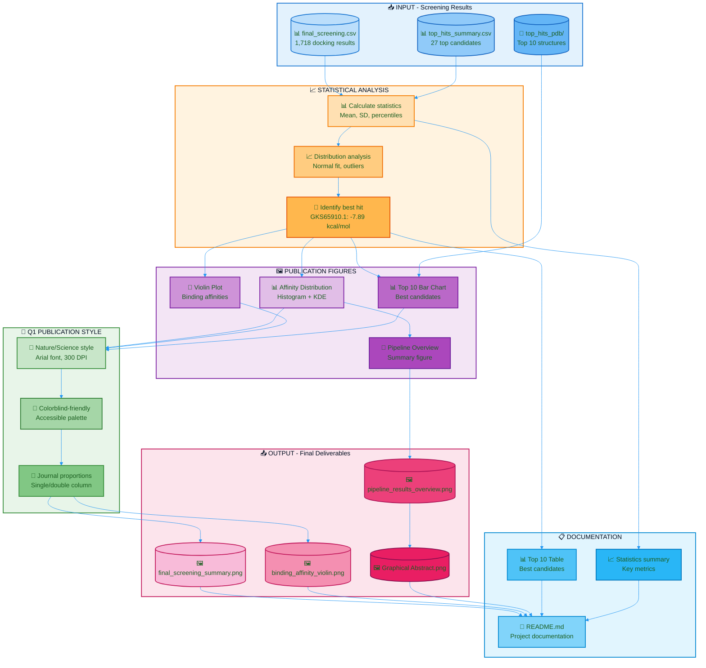

# Deep-PETase-Mining: Flowchart - Phase 5

## Color Legend

| Color | Meaning |
|-------|---------|
| 🔵 Blue | Inputs / Documentation |
| 🟠 Orange | Statistical Analysis |
| 🟣 Purple | Figure Generation |
| 🟢 Green | Styling |
| 🌸 Pink | Final Outputs |
| 🩵 Light Blue | Documentation |

## Phase 5 Summary

| Step | Description | Output |
|------|-------------|--------|
| Data loading | Import screening results | DataFrames |
| Statistics | Mean, SD, percentiles | -5.49 ± 0.60 kcal/mol |
| Best hit | Lowest binding affinity | GKS65910.1: -7.89 kcal/mol |
| Figures | Publication-quality plots | PNG 300 DPI |
| Style | Nature/Science format | Q1 Scopus ready |
| Documentation | README + tables | GitHub ready |
