# Deep-PETase-Mining: Flowchart - Phase 5

```mermaid
%%{init: {'theme': 'base', 'themeVariables': { 'primaryColor': '#e8f5e9', 'primaryTextColor': '#1b5e20', 'primaryBorderColor': '#4caf50', 'lineColor': '#2196f3', 'secondaryColor': '#e3f2fd', 'tertiaryColor': '#fff3e0'}}}%%

graph TD
    subgraph INPUT["📥 INPUT - Screening Results"]
        style INPUT fill:#e3f2fd,stroke:#1976d2,stroke-width:2px
        A[("📊 final_screening.csv<br/>1,718 docking results")]
        B[("📊 top_hits_summary.csv<br/>27 top candidates")]
        C[("📁 top_hits_pdb/<br/>Top 10 structures")]
    end

    subgraph ANALYSIS["📈 STATISTICAL ANALYSIS"]
        style ANALYSIS fill:#fff3e0,stroke:#f57c00,stroke-width:2px
        D["📊 Calculate statistics<br/>Mean, SD, percentiles"]
        E["📈 Distribution analysis<br/>Normal fit, outliers"]
        F["🎯 Identify best hit<br/>GKS65910.1: -7.89 kcal/mol"]
    end

    subgraph FIGURES["🖼️ PUBLICATION FIGURES"]
        style FIGURES fill:#f3e5f5,stroke:#7b1fa2,stroke-width:2px
        G["📊 Affinity Distribution<br/>Histogram + KDE"]
        H["🎻 Violin Plot<br/>Binding affinities"]
        I["📊 Top 10 Bar Chart<br/>Best candidates"]
        J["🔬 Pipeline Overview<br/>Summary figure"]
    end

    subgraph STYLE["🎨 Q1 PUBLICATION STYLE"]
        style STYLE fill:#e8f5e9,stroke:#388e3c,stroke-width:2px
        K["🎨 Nature/Science style<br/>Arial font, 300 DPI"]
        L["🌈 Colorblind-friendly<br/>Accessible palette"]
        M["📐 Journal proportions<br/>Single/double column"]
    end

    subgraph OUTPUT["📤 OUTPUT - Final Deliverables"]
        style OUTPUT fill:#fce4ec,stroke:#c2185b,stroke-width:2px
        N[("🖼️ final_screening_summary.png")]
        O[("🖼️ binding_affinity_violin.png")]
        P[("🖼️ pipeline_results_overview.png")]
        Q[("🖼️ Graphical Abstract.png")]
    end

    subgraph REPORT["📋 DOCUMENTATION"]
        style REPORT fill:#e1f5fe,stroke:#0288d1,stroke-width:2px
        R["📄 README.md<br/>Project documentation"]
        S["📊 Top 10 Table<br/>Best candidates"]
        T["📈 Statistics summary<br/>Key metrics"]
    end

    %% Main connections
    A --> D
    B --> D
    D --> E
    E --> F
    F --> G
    F --> H
    F --> I
    G --> K
    H --> K
    I --> K
    K --> L
    L --> M
    M --> N
    M --> O
    G --> J
    J --> P
    P --> Q
    C --> I
    N --> R
    O --> R
    Q --> R
    F --> S
    D --> T
    S --> R
    T --> R

    %% Individual node styles
    style A fill:#bbdefb,stroke:#1976d2,stroke-width:2px
    style B fill:#90caf9,stroke:#1565c0,stroke-width:2px
    style C fill:#64b5f6,stroke:#1565c0,stroke-width:2px
    style D fill:#ffe0b2,stroke:#f57c00,stroke-width:2px
    style E fill:#ffcc80,stroke:#ef6c00,stroke-width:2px
    style F fill:#ffb74d,stroke:#e65100,stroke-width:2px
    style G fill:#e1bee7,stroke:#7b1fa2,stroke-width:2px
    style H fill:#ce93d8,stroke:#7b1fa2,stroke-width:2px
    style I fill:#ba68c8,stroke:#7b1fa2,stroke-width:2px
    style J fill:#ab47bc,stroke:#6a1b9a,stroke-width:2px
    style K fill:#c8e6c9,stroke:#388e3c,stroke-width:2px
    style L fill:#a5d6a7,stroke:#2e7d32,stroke-width:2px
    style M fill:#81c784,stroke:#388e3c,stroke-width:2px
    style N fill:#f8bbd9,stroke:#c2185b,stroke-width:2px
    style O fill:#f48fb1,stroke:#c2185b,stroke-width:2px
    style P fill:#ec407a,stroke:#ad1457,stroke-width:2px
    style Q fill:#e91e63,stroke:#880e4f,stroke-width:2px
    style R fill:#81d4fa,stroke:#0288d1,stroke-width:2px
    style S fill:#4fc3f7,stroke:#0288d1,stroke-width:2px
    style T fill:#29b6f6,stroke:#0277bd,stroke-width:2px
```

## Color Legend

| Color | Meaning |
|-------|---------|
| 🔵 Blue | Inputs / Documentation |
| 🟠 Orange | Statistical Analysis |
| 🟣 Purple | Figure Generation |
| 🟢 Green | Styling |
| 🌸 Pink | Final Outputs |
| 🩵 Light Blue | Documentation |

## Phase 5 Summary

| Step | Description | Output |
|------|-------------|--------|
| Data loading | Import screening results | DataFrames |
| Statistics | Mean, SD, percentiles | -5.49 ± 0.60 kcal/mol |
| Best hit | Lowest binding affinity | GKS65910.1: -7.89 kcal/mol |
| Figures | Publication-quality plots | PNG 300 DPI |
| Style | Nature/Science format | Q1 Scopus ready |
| Documentation | README + tables | GitHub ready |
